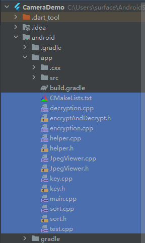
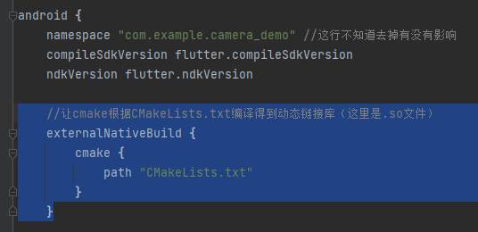
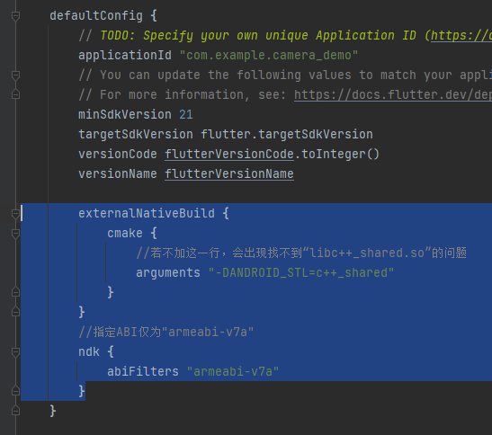
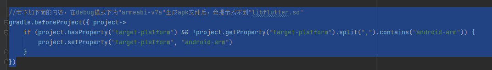
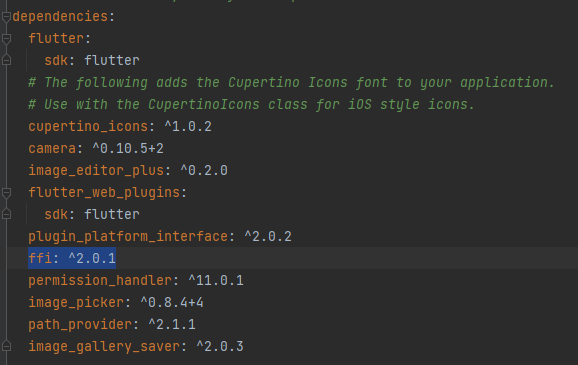
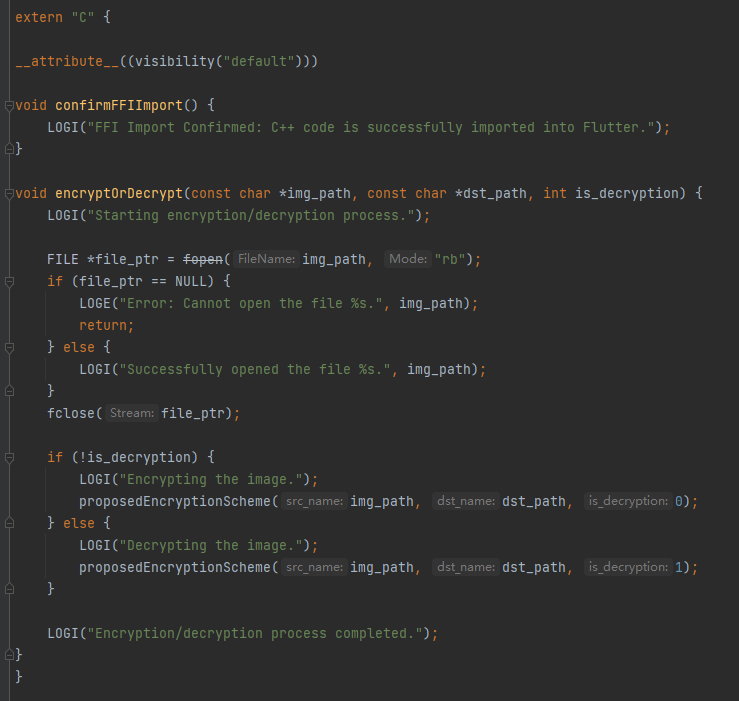
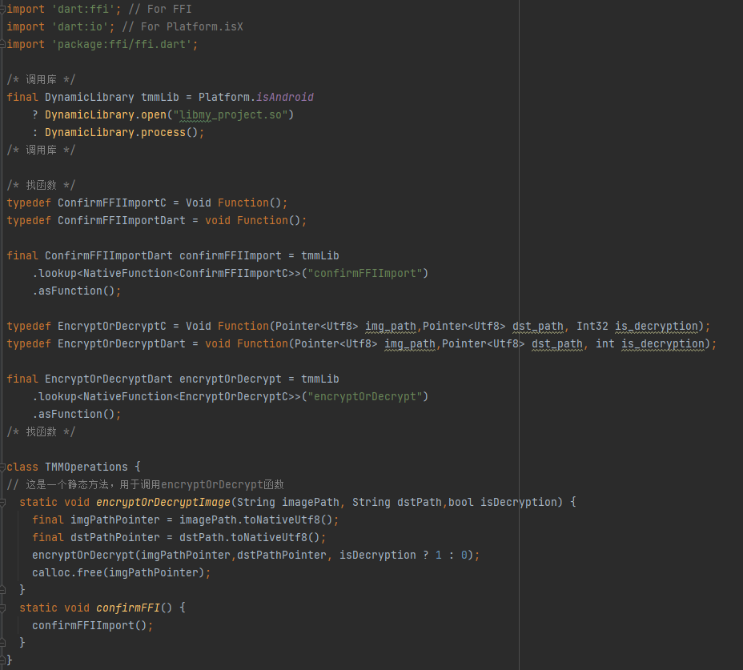

<h1 align="center">CameraDemo :camera:</h1>
<p align="center">
SRP项目代码长眠于此~
</p>

- [技术栈选择](#技术栈选择)
- [环境依赖](#环境依赖)
- [部署步骤](#部署步骤)
- [项目预览](#项目预览)
  - [主页面](#主页面)
  - [次级页面](#次级页面)
- [关键目录结构](#关键目录结构)
- [To-do List](#to-do-list)

# 技术栈选择

本项目采用的跨平台开发框架是Flutter，主要是因为具有热重载的特性，开发效率较高的同时上手难度较低，blablabla~

# 环境依赖

* Android Studio 2022.1.1
* Flutter 3.7.8
* Dart 2.19.5

如何配置环境依赖可以参考：[搭建Flutter开发环境](https://book.flutterchina.club/chapter1/install_flutter.html#_1-3-1-%E5%AE%89%E8%A3%85flutter)

⚠️ Flutter版本尽量保持一致，免得出现一些奇怪的报错

# 部署步骤

```git
git clone https://github.com/3urek4/CameraDemo.git
```

或者直接下载ZIP文件解压打开。

如何运行已下载的项目可以参考：[连接设备运行Flutter应用](https://book.flutterchina.club/chapter1/install_flutter.html#_1-3-3-%E8%BF%9E%E6%8E%A5%E8%AE%BE%E5%A4%87%E8%BF%90%E8%A1%8Cflutter%E5%BA%94%E7%94%A8)
（记得先点进`pubspec.yaml`文件点击上方`Pub get`指令获取依赖）

# 项目预览

## 主页面

  

## 次级页面

  ​

# 关键目录结构

```shell
├─lib
│  │  globals.dart  // 存储全局变量
│  │  native.dart  // 
│  │  main.dart  // 主程序
│  │  
│  └─screens
│     camera_screen.dart  // 相机界面
│     edit_screen.dart  // 图片编辑界面
│     gallery_screen.dart  // 相册界面
│     settings_screen.dart  // 设置界面
```

# 加解密算法实现

## 使用的算法是什么

使用的算法来源于何军辉老师在《IEEE Transactions on Multimedia》上的一篇论文：[JPEG Image Encryption With Improved Format Compatibility and File Size Preservation](https://ieeexplore.ieee.org/abstract/document/8319513) 。

可以从论文的摘要大致了解这个算法：

>在数字图像加密的领域中，相较于光栅图像，压缩图像受到的关注较少。许多现有的JPEG图像加密方案要么与JPEG标准兼容性不佳，要么会导致加密后的JPEG图像文件大小显著增加。为了解决这些问题，论文提出了一种新的加密方法。
>
>这种方法的主要步骤为：
>
>1. 对JPEG图像中的直流系数（DC系数）编码进行分组和置换。这些编码是对量化直流系数差异进行编码的，将具有相同符号的连续DC编码分为一组，并在每组内部进行置换。
>2. 对于每个DC编码的组，根据组的大小（随迭代次数增加）和是否在解码过程中发生量化直流系数溢出，可能会交换组的左半部分和右半部分。
>3. 所有交流系数（AC系数）根据它们的零游程长度被分类为63个类别，然后在每个类别内分别对AC编码进行混乱。
>4. 所有最小编码单元（MCUs）除直流系数外，作为一个整体被随机打乱。
>
>此外，为了提高安全性，论文中提出使用与图像内容相关的加密密钥。实验结果表明，加密后的JPEG图像文件大小与原始图像文件大小几乎相同，只有由于字节对齐导致的轻微变化。此外，从加密的JPEG图像解码出的量化直流系数不会超出有效范围。
>
>与其他相关方法相比，提出的方法改善了格式兼容性，并且由于所有加密操作直接在JPEG位流上执行，无需重新进行熵编码。提出的方法对暴力攻击、差分密码分析、已知明文攻击和轮廓攻击证明是安全的。该方法还可以应用于彩色JPEG图像。

为了理解加密算法的具体实现原理，可能要学习关于JPEG编码（把正常图片压缩为jpg格式图片）的一些基本知识，包括：

- 原始的图片（bmp）图片是怎么组成的
- JPEG编码中的最小编码单元（MCU）是什么
- JPEG编码的四个阶段是什么
  - RGB颜色空间 -> YCbCr颜色空间
  - 离散余弦变换（DCT）
  - 量化
  - 哈夫曼编码

推荐视频：[Youtube视频链接](https://www.youtube.com/watch?v=CPT4FSkFUgs)

## 算法如何应用在项目中

何老师提供了一个C++项目，实现论文中的算法并展示了算法的执行效果。

而在flutter中，有“FFI（Foreign Function Interface）”功能，它能够允许Flutter代码调用C语言API。具体来说，它可以允许flutter绑定C语言编写的动态链接库（在Linux/Android上是.so文件，在Windows上是.dll文件，在MacOS上是.dylib文件），并使用其中定义的函数。

虽然flutter要求的是C语言的API，但我可以在需要导出的函数外部套一层`extern "C"`，使其成为一个C语言风格的接口。例如：

```c++
extern "C" {
    void my_c_function();
}
```

在使用Cmake将C++代码编译成含有加解密算法的函数的动态链接库后，我们就可以在flutter项目中直接使用C++编写的加解密函数。

## 在此项目中使用FFI的具体操作

### 生成.so文件并将其打包进apk

下面的步骤主要为了将C++代码编译成.so文件，并将所有相关的.so文件打包进最后的apk文件，以供我们后续利用FFI调用其中的API函数。

在`/android/app/`目录下，添加我们的C++代码和对应的CmakeLists.txt。



CmakeLists.txt中具体定义了如何将C++代码编译成.so文件。其中包括：

- 指定Android NDK、Cmake ToolChain的路径（需把这些路径改成自己电脑上的路径）
- 指定Android ABI和API Level
- 使用的C++动态共享库版本设定
- 使用的所有第三方库的路径（这里所有用到的第三方库统一为"armeabi-v7a"和"arm64-v8a"两个ABI编译，并存放在`/external_libs/`下。现在还没有在"arm64-v8a"下实际测试过。）
- 指定C++代码的路径
- ...

更改`/android/app/`目录下的build.gradle文件，使得Gradle调用cmake编译我们的C++代码生成动态链接库（.so文件），同时做一些其他修改。修改的内容如下：





最后，在`/android/app/`下的settings.gradle的最后还要加入以下内容，明确指定ABI是"armeabi-v7a"，以避免出现在debug模式下为"armeabi-v7a"编译时找不到“libflutter.so”的奇怪问题。



现在，可以正常地生成.so文件并将其打包进apk了。

### 利用FFI调用.so文件中的函数

经过上面的所有操作后，当运行flutter项目时，C++代码会被编译为.so文件，并且.so文件会被打包到apk文件内。但在此基础上，我们还需要利用FFI编写dart代码，在.so文件中找到对应的函数，将其转换为flutter可接受的形式，供flutter项目使用。

在项目根目录下的pubspec.yaml中加入ffi。



C++源代码中导入到.so文件中的函数如下，包括一个简单的在Logcat上打印一条信息的调试用函数和我们主要要用到的加解密函数。现在它们被`extern "c"`包裹，属于“C接口”的形式。我们使用ffi就是要在.so文件中找到这些C风格的函数，并将其转换为flutter风格的函数，以供flutter项目使用。



在项目的lib目录中，添加一个native.dart文件专门用来处理这一部分任务。native.dart的主要思路其实就是打开.so文件（这里是"libmy_project.so"），找到其中的函数并将其转换为flutter中可以使用的形式，最后定义一个类（这里是"TMMOperations"类），通过调用此类的方法就可以调用.so文件中的函数了。



在其他dart源代码中，可以直接import native.dart这个文件。然后就可以直接通过

``` dart
TMMOperations.confirmFFI();
//在Logcat上打印一条信息，表示已成功通过FFI导入.so文件中的函数
```

或

```dart
TMMOperations.encryptOrDecryptImage(imagePath, dstImagePath, isDecryption);
//第一个参数是原图片路径（String），第二个参数是处理后的图片存放的路径（String），第三个参数是“处理模式是否是加密”（bool）
```

这样的方式调用函数！

# To-do List

* [X] 已完成

  * [X] camera页面

    * [X] 捕获清晰度选择器
    * [X] 变焦控制
    * [X] 曝光控制
    * [X] 闪光模式选择器
    * [X] 翻转摄像头
    * [X] 捕获图像按钮
    * [X] 捕获图像预览
    * [X] 点击预览进入编辑页面
    * [X] 预览图像更新
  * [X] gallery页面

    * [X] 文档目录图像获取
    * [X] 选择模式
    * [X] 逐个选择/全选
    * [X] 删除
    * [X] 点击单张图片进入编辑页面
    * [X] 图像更新
  * [X] settings页面

    * [X] 密码功能
    * [X] 其他占位按钮
* [ ] 未完成

  * [x] JPEG加密解密算法（必）
  * [x] 加解密算法处理接口（必）
  * [ ] 怎么对应用中的Gallery进行读/写（必）
  * [ ] UI优化（选）
  * [ ] 保存/同步图像到相册（选）
  * [ ] 从相册导入图像（选）
  * [ ] to be continued~

P.S. 如果不考虑联网上云的话，其实感觉settings中的其他功能可有可无，这个可以后面再和老师沟通。
