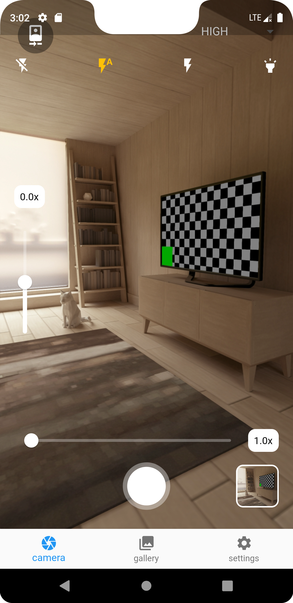
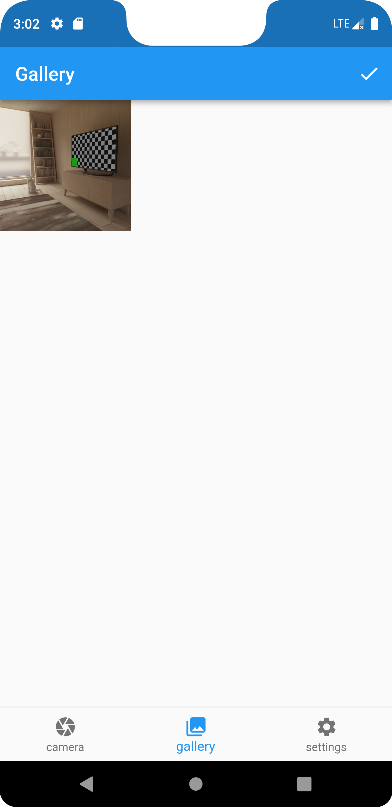
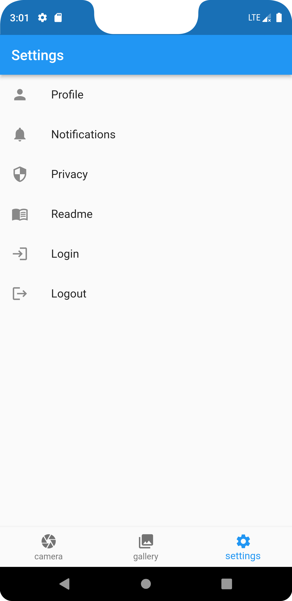
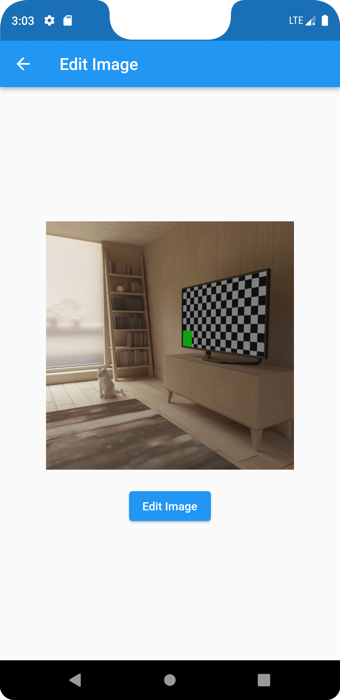
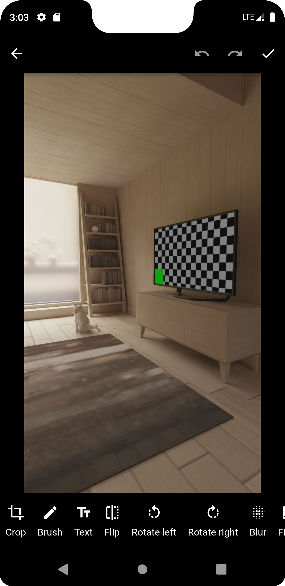
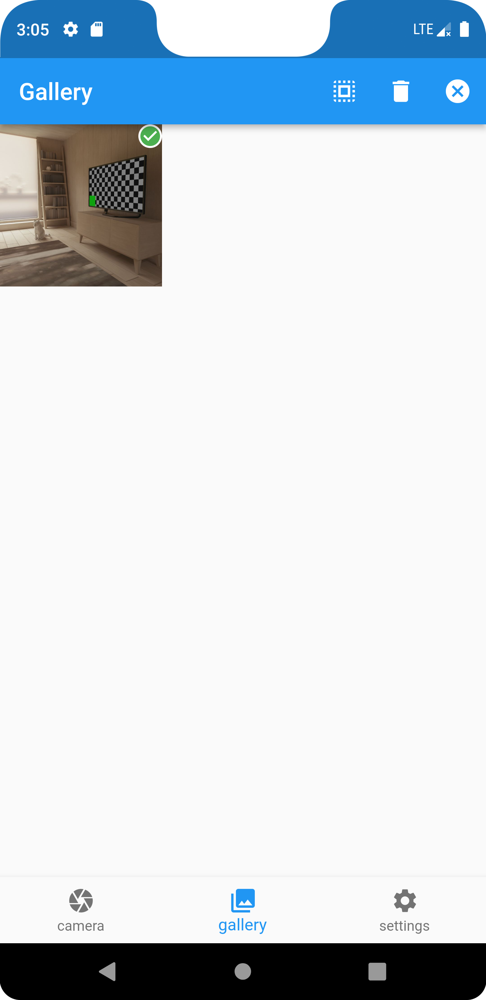

<h1 align="center">CameraDemo :camera:</h1>
<p align="center">
SRP项目代码长眠于此~
</p>

- [技术栈选择](#技术栈选择)
- [环境依赖](#环境依赖)
- [部署步骤](#部署步骤)
- [项目预览](#项目预览)
  - [主页面](#主页面)
  - [次级页面](#次级页面)
- [关键目录结构](#关键目录结构)
- [To-do List](#to-do-list)

# 技术栈选择

本项目采用的跨平台开发框架是Flutter，主要是因为具有热重载的特性，开发效率较高的同时上手难度较低，blablabla~

# 环境依赖

* Android Studio 2022.1.1
* Flutter 3.7.8
* Dart 2.19.5

如何配置环境依赖可以参考：[搭建Flutter开发环境](https://book.flutterchina.club/chapter1/install_flutter.html#_1-3-1-%E5%AE%89%E8%A3%85flutter)

⚠️ Flutter版本尽量保持一致，免得出现一些奇怪的报错

# 部署步骤

```git
git clone https://github.com/3urek4/CameraDemo.git
```

或者直接下载ZIP文件解压打开。

如何运行已下载的项目可以参考：[连接设备运行Flutter应用](https://book.flutterchina.club/chapter1/install_flutter.html#_1-3-3-%E8%BF%9E%E6%8E%A5%E8%AE%BE%E5%A4%87%E8%BF%90%E8%A1%8Cflutter%E5%BA%94%E7%94%A8)
（记得先点进`pubspec.yaml`文件点击上方`Pub get`指令获取依赖）

# 项目预览

## 主页面

  

## 次级页面

  ​

# 关键目录结构

```shell
├─lib
│  │  globals.dart  // 存储全局变量
│  │  main.dart  // 主程序
│  │  
│  └─screens
│     camera_screen.dart  // 相机界面
│     edit_screen.dart  // 图片编辑界面
│     gallery_screen.dart  // 相册界面
│     settings_screen.dart  // 设置界面
```

# To-do List

* [X] 已完成

  * [X] camera页面

    * [X] 捕获清晰度选择器
    * [X] 变焦控制
    * [X] 曝光控制
    * [X] 闪光模式选择器
    * [X] 翻转摄像头
    * [X] 捕获图像按钮
    * [X] 捕获图像预览
    * [X] 点击预览进入编辑页面
    * [X] 预览图像更新
  * [X] gallery页面

    * [X] 文档目录图像获取
    * [X] 选择模式
    * [X] 逐个选择/全选
    * [X] 删除
    * [X] 点击单张图片进入编辑页面
    * [X] 图像更新
  * [X] settings页面

    * [X] 密码功能
    * [X] 其他占位按钮
* [ ] 未完成

  * [ ] JPEG加密解密算法（必）
  * [ ] 加解密算法处理接口（必）
  * [ ] UI优化（选）
  * [ ] 保存/同步图像到相册（选）
  * [ ] 从相册导入图像（选）

P.S. 如果不考虑联网上云的话，其实感觉settings中的其他功能可有可无，这个可以后面再和老师沟通。在现在的基础上把算法接入之后，其实就是一个基本符合设想的完整项目了。

‍
